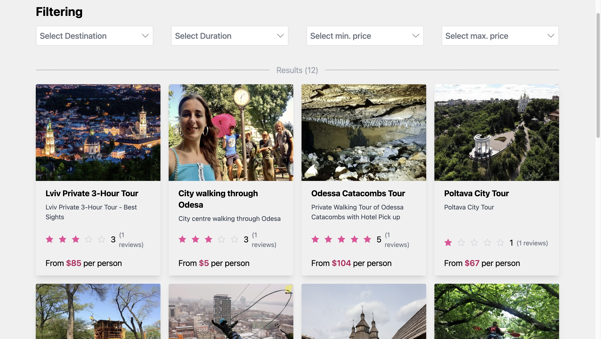
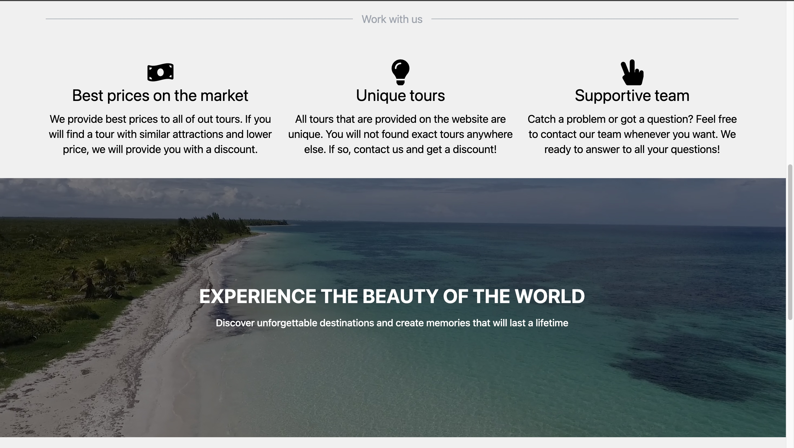
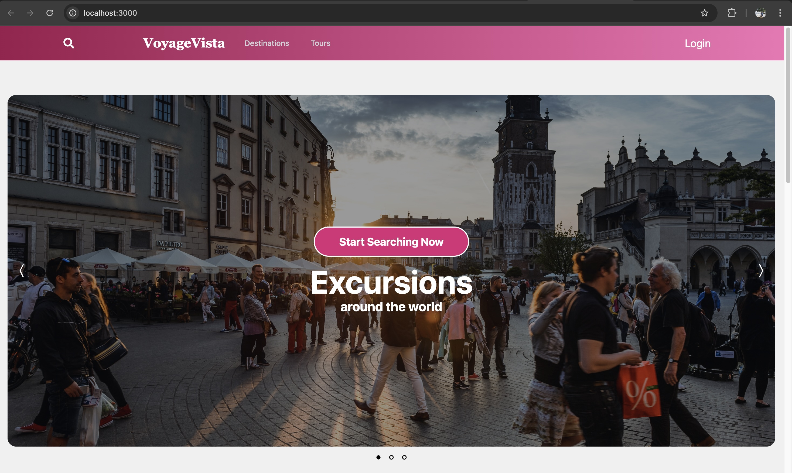
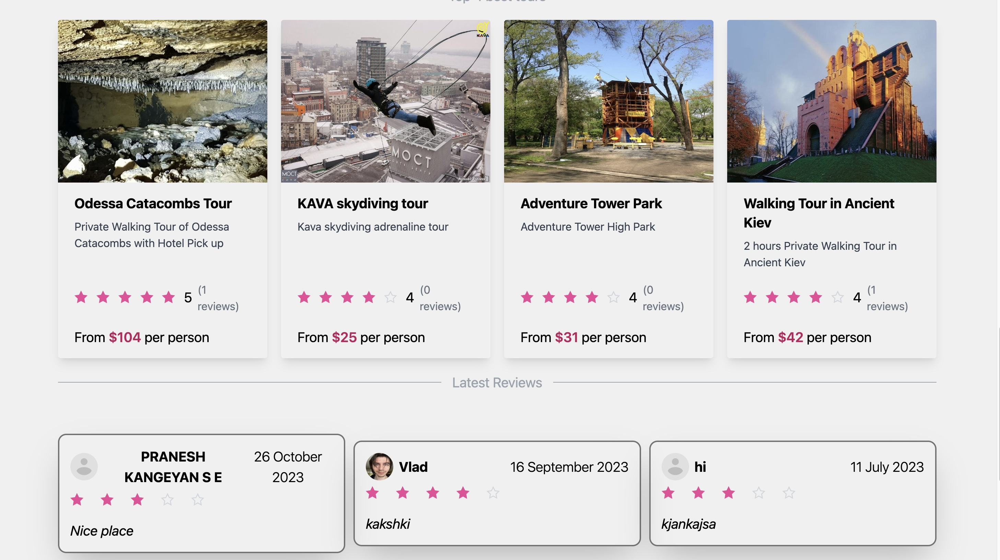
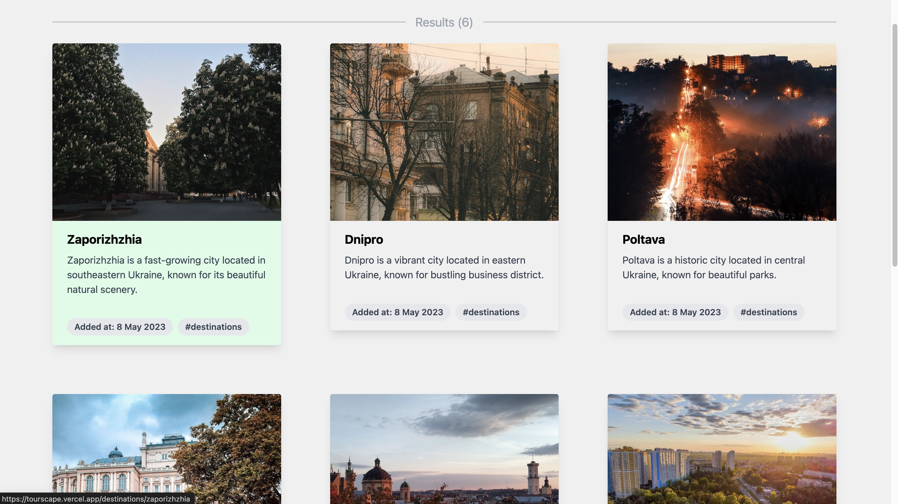

# VoyageVista🌍
**An immersive tourism experience right at your fingertips.**

Welcome to **VoyageVista**, a comprehensive platform designed to inspire, plan, and book the perfect travel adventure. VoyageVista aims to provide users with a seamless and enjoyable experience to explore tourist destinations, book tours, and access essential travel information—all in one place.

## 🌟 Features
- **Explore Destinations**: Dive into detailed descriptions of top tourist spots with vibrant images, must-visit landmarks, and local insights.
- **Booking System**: Book your preferred tours and accommodations with an easy-to-use reservation system.
- **User Reviews & Ratings**: Read authentic reviews, check ratings, and share experiences.
- **Itinerary Planner**: Plan a custom itinerary and keep track of must-visit spots for a personalized experience.
- **Real-time Support**: Reach out to us for 24/7 customer support and travel assistance.
- **Admin Panel**: Admins can upload tours and modify them.
- **Payment Integration**: Stripe Payment Integration to book tours throuh the websites.

## 🖥️ Technology Stack
- **Frontend**: React, Tailwind CSS, JavaScript
- **Backend**: Node.js, Express
- **Database**: MongoDB
- **API Integrations**: Stripe API

